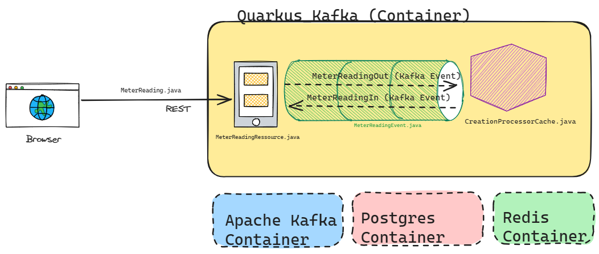

# Quarkus - Send and Receive Kafka Messages
Build a java application with a REST interface. The incoming rest call is forwarded as Kafka message.
A Kafka processor receives the incoming messages and answers with an outgoing message.

Please see the blog for installing the prerequisites: [Setup KYMA, Kafka, Postgres, Redis](https://blogs.sap.com/2024/01/09/installing-kafka-and-postgres-on-kyma/)



## Run in Dev or Prod
- [Running Quarkus in DEV mode](README_QUARKUS.md)
- For productive deployment to KYMA cluster, run [buildAndDeploy_kyma.sh](buildAndDeploy_kyma.sh)
  - <span style="color: red;">Beforehand update the Docker Account in buildAndDeploy_kyma.sh, line 7</span>.
  - Forward Port 8080 to local host to test REST


## Components of quarkus_kafka application

### *Postgres, DB entities*
  - At startup, the initial script is executed: /src/main/ressource/import.sql
  - Hibernate Object: [com.heureso.entities.MeterReading.java](./src/main/java/com/heureso/entities/MeterReading.java)


### *REST Interface and outgoing Kafka Message*
Receveing the post and preparing outgoing Kafka Message (METERREADING_OUT).

[com.heureso.boundaries.MeterReadingResource.java](./src/main/java/com/heureso/boundaries/MeterReadingResource.java)

**@POST - POST a MeterReading**
MeterReading is a Hibernate Object, which is persisted. Message is mapped to MeterReadingEvent and forwarded as Kafka Message.

**@GET - GET all readings in Database**
Returning all meterreading objects in the database.

### *Kafka Event*
MeterReadingEvent for Kafka

[PoJo: com.heureso.events.MeterReadingEvent.java](./src/main/java/com/heureso/events/MeterReadingEvent.java)

- **Deserializer JSON -> Java** ( com.heureso.event.MeterReadingEventDeserializer.java )


[Configure Incoming and Outgoing Message in application.properties](./src/main/resources/application.properties)


``` properties
#outgoing message
mp.messaging.outgoing.METERREADING_OUT.connector=smallrye-kafka
mp.messaging.outgoing.METERREADING_OUT.topic=METERREADING.CREATION.CONFIRMED
mp.messaging.outgoing.METERREADING_OUT.value.serializer=io.quarkus.kafka.client.serialization.ObjectMapperSerializer

#incoming message
mp.messaging.incoming.METERREADING_IN.connector=smallrye-kafka
mp.messaging.incoming.METERREADING_IN.propagate-headers=Authorization,Proxy-Authorization
mp.messaging.incoming.METERREADING_IN.topic=METERREADING.CREATION.REQUESTED
mp.messaging.incoming.METERREADING_IN.value.deserializer=com.heureso.events.MeterReadingEventDeserializer
```

### *Handling the Kafka Message*
Handling the Kafka Message (METERREADING_IN), storing in Redis Cache.

[com.heureso.boundaries.MeterReadingResource.java](./src/main/java/com/heureso/boundaries/CreationProcessorCache.java)

``` java
 @ActivateRequestContext
    @Incoming("METERREADING_IN")
    @Acknowledgment(Acknowledgment.Strategy.POST_PROCESSING)

    public Uni<Void> process(Message<MeterReadingEvent> meterreadingmessage)
    {
        MeterReadingEvent meterreadingevent = meterreadingmessage.getPayload();

        Optional<IncomingKafkaRecordMetadata> incomingKafkaRecordMetadata = meterreadingmessage.getMetadata(IncomingKafkaRecordMetadata.class);
```
